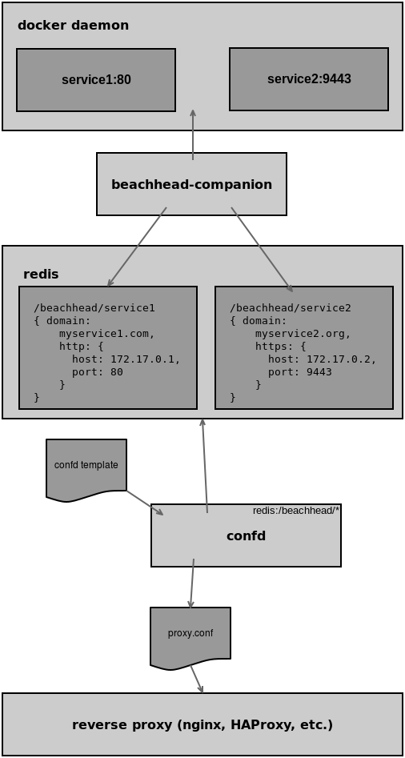

# beachhead-companion
Service registration using [Redis](http://redis.io/), [Docker](https://www.docker.com/) and [confd](http://www.confd.io/).

`beachhead-companion` is a small daemon reads domain name and port information from docker meta data and publishes that
information on a redis instance, ready for `confd` to consume. 
The primary use case is **automatic reverse proxy configuration based on container meta information**.

When you start your containers, you add a special environment variable that lists 1) _the domain names_ and 2) _the http
 and/or https ports_.

**Example:**
If your container command line looks like this:
```
docker run -e BEACHHEAD_DOMAINS='example.org admin.example.org:https app.example.org:http=8080:https=8043' ...
```
`beachhead-companion` will extract the following domain/port mappings:
```
example.org with http=80, https=443
admin.example.org with https=443
app.example.org with http=8080 and https=8043
```

## Design


The core idea behind a setup using `beachhead-companion` and `confd` is to have **a system that automatically converges into
  sensible configurations**. 
You start a new docker container that specifies that it wants to be exposed under a certain
  domain name. 
The system then takes over from there, re-configuring your reverse proxy automatically to serve requests
  for that domain to the correct container. 
  
The information published to redis is intentionally held generic. You might add additional consumers that, for instance,
  set up an SSL certificate using [Let's Encrypt](https://letsencrypt.org/) or re-configure DNS servers 
  ([Amazon AWS Route 53](https://aws.amazon.com/route53/) or similar).
  
### Polling and Expiration
`beachhead-companion` periodically inspects the docker daemon for containers that need to be mapped on a reverse proxy.
When it publishes the configurations it has read from the docker daemon, it usually assigns an expiration date to each
 such 'publication'. 
 
With Redis, that expiration is implemented using the [SETEX](http://redis.io/commands/setex) command. 
That means that `beachhead-companion` doesn't have to 'remember' what it has published in case a container suddenly 
vanishes. That makes `beachhead-companion` simpler to implement. 
It also means that **published configuration will disappear unless continuously refreshed**.

You can disable expiration, with the trade-off that the entries that belong to containers that have disappeared will 
remain active forever.
 
Unless specified otherwise, the expiration time used by `beachhead-companion` is 60 seconds.
The polling rate is a generous 45% of the configured expiration time by default. 
In the default case, `beachhead-companion` would therefore query the docker daemon once every 27 seconds.

### Why Redis?
No particular reason. 
It had the features I required: expiration of values and the ability to query values with a certain key prefix.
In my case, I had to deal with single-node setups, so the dedicated configuration systems like `etcd` seemed like overkill.

Teaching `beachhead-companion` to publish configuration to other systems shouldn't be too difficult to implement.
I intentionally abstracted the publication away behind a [Publisher](src/publisher/mod.rs) trait.

### Why Docker?
Because I use docker in my deployment. 
Again, it shouldn't be too difficult to teach `beachhead-companion` to access other configuration sources.
There is an [Inspector](src/inspector/mod.rs) trait that abstracts the query part.

### Why the name?
The whole setup is ~~blatantly copied from~~ inspired by a combination of 
[DigitalOcean's How to use `confd` and `etcd` to dynamically reconfigure services in CoreOS](https://www.digitalocean.com/community/tutorials/how-to-use-confd-and-etcd-to-dynamically-reconfigure-services-in-coreos) and a precursor to [docker-etcd-registrator](https://www.npmjs.com/package/docker-etcd-registrator)
The 'companion' part came from me not remembering the exact wording of the article and picking the first synonym that came to mind.
'Beachhead' is simply the name I used for the reverse proxy in the particular setup I wrote this tool for. 
As in 'the part that comes into contact with the big bad internet.'

## Building
To build `beachhead-companion` you need
 
 * cargo
 * rustc
 * openssh libraries and header files
 * systemd libraries and header files

The most convenient way to get rust and cargo is via [rustup](https://rustup.rs/). 
The header files should be available in your OS distribution.
It would not be difficult to make the `systemd` part of the build optional (not just an option at runtime) but I haven't seen the need so far.
